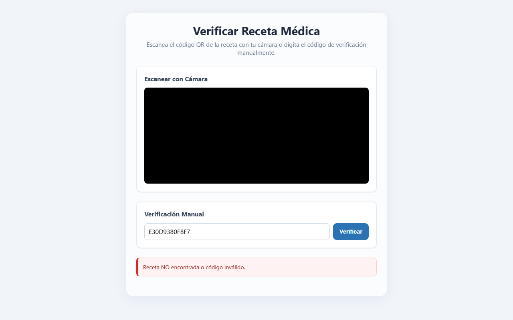
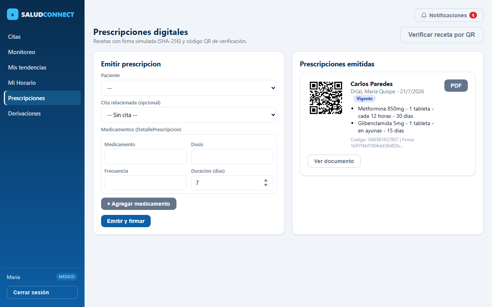
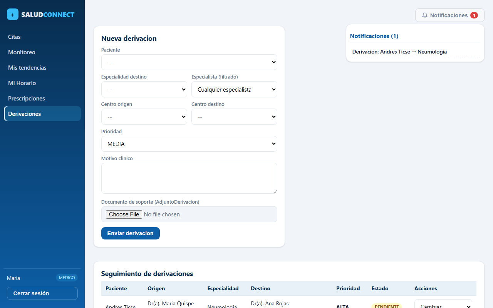

# 📄 Entregables del Módulo - David Angel Toribio Anselmo
**Proyecto:** SALUDCONNECT - Sistema de Telemedicina para Sierra Central
**Rol:** Desarrollador backend/frontend responsable de Prescripciones y Derivaciones

Este documento consolida la implementación completa, arquitectura y capturas del módulo asignado a **David Angel Toribio Anselmo** en la rama principal (`main`).

---

## 🛠️ Resumen de Implementación

### 1. Prescripciones Médicas Digitales (RF-05)
- **Firma Digital SHA-256**: Generación automática e inmutable al crear la receta en el backend a través del algoritmo `SHA-256(medico_id + paciente_id + codigo + fecha_emision)`.
- **Código de Verificación QR**: Código alfanumérico único de 12 caracteres (UUID corto).
- **Endpoint Público**: `/api/v1/prescripciones/verificar/?codigo=XXX` permite a las farmacias y pacientes verificar la autenticidad sin necesidad de iniciar sesión.
- **Exportación a PDF**: Generación de documentos PDF en el backend con la librería `reportlab`.

### 2. Derivaciones entre Niveles de Atención (RF-06)
- **Flujo de Interconsulta**: PENDIENTE ➔ ACEPTADA / RECHAZADA ➔ COMPLETADA.
- **Filtrado por Especialidad**: La interfaz filtra a los médicos del sistema según la especialidad seleccionada para la interconsulta.
- **Adjuntos de Soporte**: Permite cargar archivos clínicos (informes, exámenes) asociados a la derivación.

### 3. Notificaciones del Sistema
- **Notificaciones In-App**: Polling en el Layout que alerta sobre nuevas derivaciones interconsultas y cambios de estado.
- **Integración con Auditoría**: Registro automático en `LogAuditoria` con acción `NOTIF` para alertar al especialista correspondiente.

---

## 📸 Capturas de Pantalla (Interfaces Profesionales)

### 1. Verificación Pública de Recetas por QR (Módulo de Acceso Libre)
Esta página es de acceso público y permite la comprobación de recetas por parte de farmacias o pacientes escaneando el QR o digitando el código.

### 2. Panel de Emisión de Prescripciones Digitales (Médico)
Vista donde el médico emite la receta digital con medicamentos anidados y visualiza la lista de recetas con sus respectivos códigos QR.

### 3. Seguimiento e Interconsultas de Derivaciones
Módulo para realizar el seguimiento, filtrado y envío de derivaciones entre diferentes centros médicos.

### 4. Notificaciones en Tiempo Real (Campana superior)
Menú desplegable en el encabezado de navegación que alerta al médico y especialista sobre nuevas derivaciones.

---

## 🧪 Pruebas Unitarias Exitosas
Se implementaron y ejecutaron las pruebas automatizadas del backend para verificar el correcto funcionamiento del modelo, endpoints públicos y control de estados:

- **Prescripciones**: `test_creacion_prescripcion_con_detalles`, `test_verificar_endpoint_publico`, `test_pdf_endpoint_publico`
- **Derivaciones**: `test_crear_derivacion_y_notificar`

Las pruebas se ejecutaron exitosamente obteniendo un resultado limpio de `OK`.
